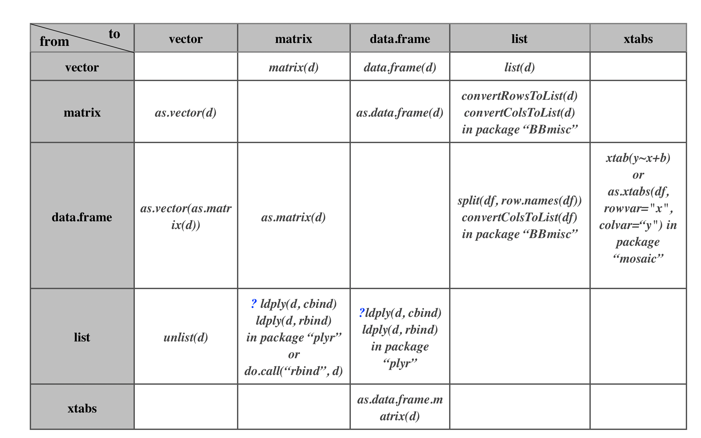
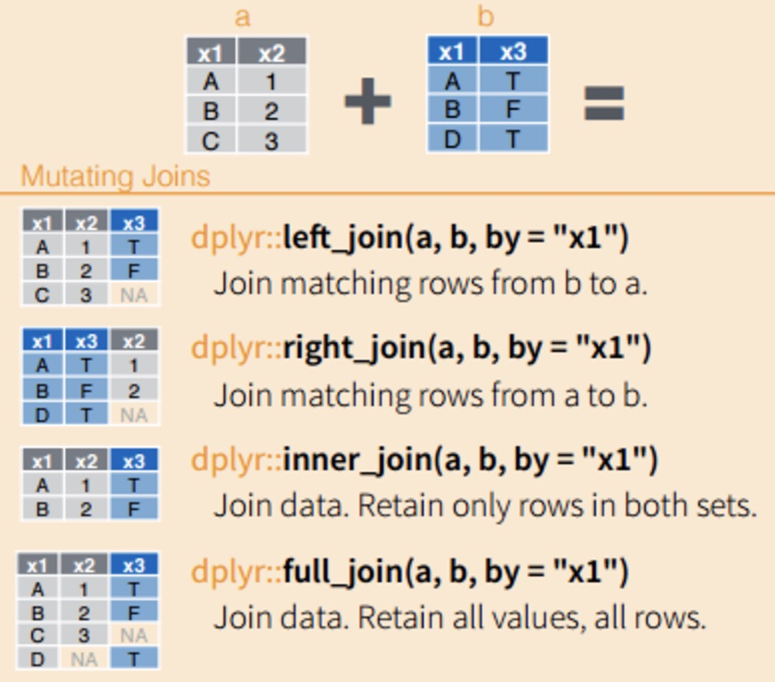

```{r setup, include=FALSE}
library(knitr)
library(ggplot2)
library(dplyr)
library(tidyr) # gather & spread
library(tidyverse)
library(purrr)
knit_hooks$set(crop = hook_pdfcrop, pars = function(before, options, envir) {
  if (before) {
    par(family = my.font)
  } else {
    NULL
  }
})
opts_chunk$set(
  fig.path = "figures/",
  dev = "cairo_pdf", dev.args = list(bg = "white"), # or quartz_pdf (for lattice)
  fig.height = 5,
  fig.width = 6,
  message = F,
  warning = F,
  autodep = T,
  cache.comments = F,
  crop = T,
  comment = NA,
  pars = T
)
# graphics setup:
my.font <- "Helvetica"
```


\clearpage

Introduction
============

Data types (numeric, character & logical)
----------------

- numeric (integer or real)
- character/string
- logical (T/F)


```{r basic data types}
pi = 3.14
lang = "Estonian"
exist = TRUE
```


Data structures (vector, factor, matrix, data.frame, list)
------------

- vector
- factor
- matrix (n-d array)
- data.frame
- list

```{r basic data structures}
myvec = c(1, 3, 5, NA)
myfact = factor(c("male", "male", "female"), levels = c("male", "female"))
mymat = matrix(1:12, nrow = 3, ncol = 4, byrow = T)
mydf = data.frame(id = 1:4, lang = c("Estonian", "Finnish", "Hungarian", "North Saami"), 
                  subfam = factor(c("Finnic", "Finnic", "Ugric", "Saami")))
myls = list(myvec, myfact, mymat, mydf)
```


{#id .class width=60% height=100%}

It is important to know what type of data you are working with, since all functions and commands in R are defined to specific data types. For example, you can calculate the `sum` of a numeric vector rather than a factor. Sometimes, you need to convert between different data types and structures (see table below). 

```{r eval = F}
as.character(myvec)
as.integer(myfact)
as.data.frame(mymat)
```


{#id .class width=60% height=100%}

\clearpage

Data.frame manipulation
-------------------

### Combine two data.frames (rbind & cbind)


```{r rbind, eval = F}
x = data.frame(i = c("a", "b", "c"), j = 1:3, stringsAsFactors = FALSE)
y = data.frame(i = c("d", "e", "f"), j = 4:6, stringsAsFactors = FALSE)
rbind(x, y)
```
```{r cbind, eval = F}
x = data.frame(i = c("a", "b", "c"), j = 1:3, stringsAsFactors = FALSE)
y = data.frame(m = c("d", "e", "f"), n = 4:6, stringsAsFactors = FALSE)
cbind(x, y)
```

### Join two data.frames (inner_join, left_join & right_join)


{#id .class width=60% height=200%}

```{r join two data frames}
lang_df = data.frame(id = 1:4, 
                     lang = c("Estonian", "Finnish", "Hungarian", "North Saami"), 
                     value = c(0, 1, 0, 1))
subfam_df = data.frame(lang = c("Estonian", "Finnish", "Hungarian", "North Saami"), 
                       subfam = c("Finnic", "Finnic", "Ugric", "Saami"))
inner_join(lang_df, subfam_df, by = "lang")
```

### Reshape a data.frame (pivot_wider & pivot_longer)

It is quite common to convert data.frame between wide and long formats, so that you can easily aggregate and summarise the results. Here I am going to use `pivot_wider` and `pivot_longer` to reshape the data. Note: if it does not give you the right format, it is probably due to the duplicated row id you have in your data.

{#id .class width=80% height=100%}

```{r reshape data into long format}
lang_trait = data.frame(lang = c("Estonian", "Finnish", "Hungarian", "North Saami"), 
                        trait1 = c(0, 1, 1, 0), 
                        trait2 = c(0, 0, 1, 0), 
                        trait3 = c(1, 0, 1, 1))
df_long = pivot_longer(lang_trait, -lang, 
             names_to = "feature", values_to = "value")
# alternatively: gather(lang_trait, key = feature, value = value, -lang)
```

```{r reshape data into wide format}
df_wide = pivot_wider(df_long, names_from = "feature", values_from = "value")
# alternatively: spread(df_long, key = feature, value = value)
```


Exercise
-------------

(1) Pls load the UraTyp values and language table, and join the two tables by Language ID. Note: the two data.frames have different names for the language ID.


\clearpage

R programming language
=====================

Conditional statement
---------------------

```{r}
lang = "Finnish"
if(lang == "Estonian"){
  print("It is true!")
}else{
  print("It is false!")
}
```

For loop
------------

```{r}
langs = c("Estonian", "Finnish", "Hungarian", "North Saami")
for(l in langs){
  print(l)
}
```

Function
-------------

```{r}
mysum = function(numvec){
  total = 0
  for(i in numvec){
    total = total + i
  }
  return(total)
}
```


```{r}
mysum(numvec = 1:10)
```


