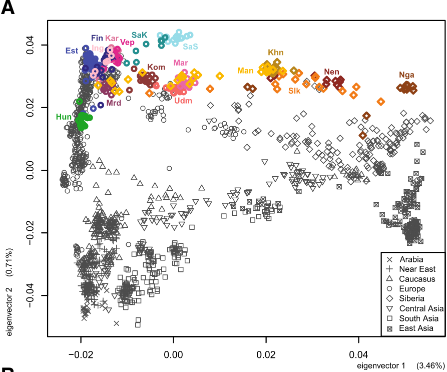

Michael Dunn, 6th of April 2022

<!-- 14.30 - 15:30 *Data clustering with Principal Components Analysis (PCA)* --> 

- Revision of previous lesson (to be decided)
- More on `pivot_wider()` and `pivot_longer()`

## Principal components analysis

- Interpreting multidimensional data

  * What is a dimension?

- PCA creates creates new dimensions which summarise the variance of the old dimensions such that the first dimension captures the most variance, the second captures as much as possible of the residue, the third likewise...

  * Three-dimensional example of dimensional rotation
  
- Intpreting the new components

  * If you're lucky they correlate with something you can identify in the real world — but no guarantee!
  


- Works from wide data: rows are taxa (languages, species, individuals, etc), and columns are features (typological states, other types of measurement)
 
  * This is because each observation is a combination of all its values for every parameter (moral: for some purposes wide data *is* tidy)

Make the data frame for analysis, join the language names:
```{r message=FALSE}
values <- read_csv("../data/values.csv")  %>%
  filter(grepl("UT", Parameter_ID)) %>%
  mutate(Value=as.integer(Value)) %>%
  pivot_wider(Language_ID, names_from=Parameter_ID, values_from=Value) 
#values
languages <- read_csv("../data/languages.csv") %>% select(Name, Language_ID=ID)
#languages
languages %>%
  inner_join(values) %>%
  select(-Language_ID) ->
  uratyp_data
```

PCA requires a matrix/data.frame which contains only the data to analyse; labels are kept separate as row names (tidyverse function are phasing out the idea of having separate rownames: all columns are columns)
```{r}
#language_names <- uratyp_data$Name 
#uratyp_data <- as.data.frame(uratyp_data %>% select(-Name))
#row.names(uratyp_data) <- language_names
uratyp_data <- uratyp_data %>% column_to_rownames("Name")
```

PCA can't deal with missing data very well. It also hates invariant columns (how do you sensibly talk about the variance of something that doesn't vary?!)
```{r}
library(janitor)
# uratyp_data[is.na(uratyp_data)] <- 0.5 # :-(
uratyp_data %>% 
  select_if(function(x) !any(is.na(x)))  %>%
  remove_constant() %>%
  prcomp() ->
  uratyp_pca
```

Numeric summary:
```{r}
summary(uratyp_pca)
```

Old school visualisation:
```{r}
biplot(uratyp_pca)
```

The pca object is a list with an attribute called (uninformatively) `x` which contains the values of the components. With a bit of housekeeping we can put this back in a tidy form which is easy to plot

```{r}
languages <- read_csv("../data/languages.csv") %>% select(Name, Subfamily)
uratyp_pca$x[,c("PC1", "PC2")] %>% 
  as.data.frame() %>% 
  rownames_to_column("Name") %>% 
  inner_join(languages) %>%
  ggplot(aes(x=PC1, y=PC2, label=Name, colour=Subfamily)) + geom_text()
```
The legend is ugly — we want to remove the "a" text examples, and put the subfamily labels directly in the target colour. This can be done, but it's currently quite complicated. Instead we can just zap the legend:

```{r}
languages <- read_csv("../data/languages.csv") %>% select(Name, Subfamily)
uratyp_pca$x[,c("PC1", "PC2")] %>% 
  as.data.frame() %>% 
  rownames_to_column("Name") %>% 
  inner_join(languages) %>%
  ggplot(aes(x=PC1, y=PC2, label=Name, colour=Subfamily)) + 
    geom_text() +
    theme(legend.position = "none")
```

🤨 **Exercise** What kind of interesting PCAs can we make with the uratyp data?

  - consider subsets of the data, particular typological domains
  - compare grambank to uratyp data?