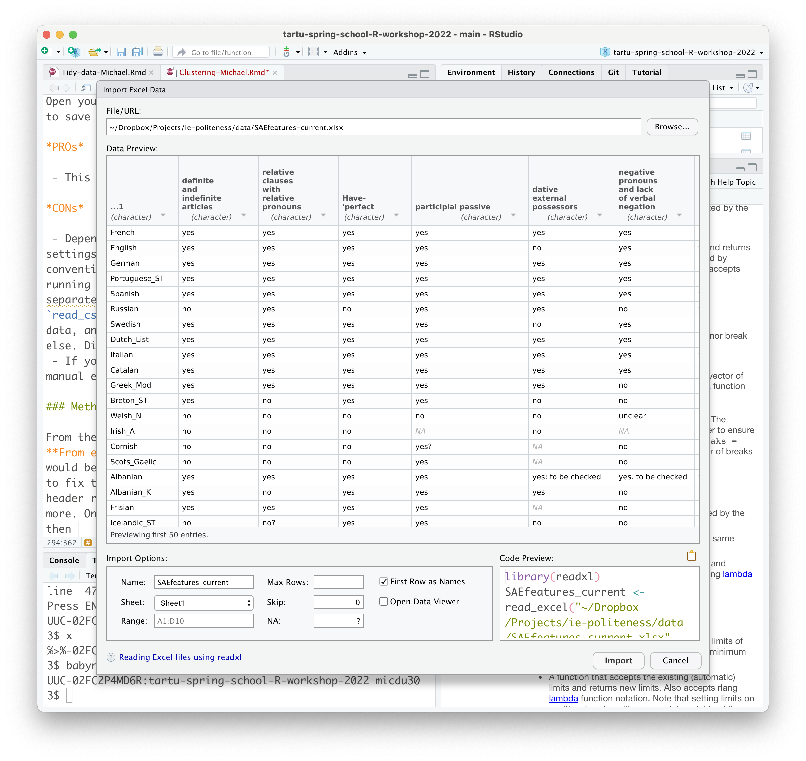

Michael Dunn, 6th of April 2022

<!-- 14.30 - 15:30 *Data clustering with Principal Components Analysis (PCA)* --> 

## Revision

- Load the uratyp data
```{r message=FALSE}
library(tidyverse)
values <- read_csv("https://raw.githubusercontent.com/cldf-datasets/uratyp/v1.1/cldf/values.csv") 
languages <- read_csv("https://raw.githubusercontent.com/cldf-datasets/uratyp/v1.1/cldf/languages.csv")
parameters <- read_csv("https://raw.githubusercontent.com/cldf-datasets/uratyp/v1.1/cldf/parameters.csv")
```
- Piping between functions

```{r}
#View(languages)
#languages %>% View()
languages %>% names()
```
```{r}
languages %>% nrow()
```
- Filtering 
```{r}
# filter chooses row
languages %>% filter(Subfamily == "Saami")
```
```{r}
languages %>% 
  filter(Name == "Hungarian") %>%
  select(Name, Latitude, Longitude)
```
```{r}
finnic <- languages %>%
  filter(Subfamily == "Finnic") %>%
  select(Name, Latitude, Longitude)
```

The `<-` assignment symbol can also be written `=`:
```{r}
finnic = languages %>%
  filter(Subfamily == "Finnic") %>%
  select(Name, Latitude, Longitude)
```

There's also a rightwards assignment symbol:
```{r}
languages %>%
  filter(Subfamily == "Finnic") %>%
  select(Name, Latitude, Longitude) -> finnic
```

Other random points:

- R remembers everything since you last restarted R. This can cause problems in a notebook if you e.g. define something in one chunk, then go back and use it in an earlier chunk. It'll work the first time, but when you restart R and try to run the chunks from top to bottom it won't. I test these files by restarting R and running all chunks from the beginning. You can do this by selecting the *Restart R and Run All Chunks* under the **Run** button in the top right of this tab.
- The inverse of `read_csv()` is `write_csv()`. You can use the `write_csv()` function to put your fancy new table into a file, e.g. 
```{r}
languages %>%
  filter(Subfamily == "Finnic") %>%
  select(Name, Latitude, Longitude) %>%
  write_csv("finnic_geographic_data.csv")
```

## Grouping and summarising

- `summarise` returns a new table with a single row summarising the entire group
- `group_by` turns the table into multiple sub-tables which can be operated on separately

```{r}
my_values <- c(4,5,6,7)
mean(my_values)
```

```{r}
# Average latitude and longitude is a weird thing to do, but I don't want to 
# introduce a new dataset with something sensible to average, so we'll just 
# pretend it isn't stupid
languages %>%
   group_by(Subfamily) %>%
   summarise(mean_latitude=mean(Latitude), mean_longitude=mean(Longitude))
```
```{r}
values %>%
  group_by(Parameter_ID) %>%
  summarise(Number_of_1s=sum(as.integer(Value)))
```

The `n()` function counts the number of lines in its group (or in the entire table if it isn't grouped)
```{r}
languages %>%
  group_by(Subfamily) %>%
  summarise(n_languages=n())
```

## Joining

Two different tables can be joined if they both have columns containing the same set of values. These include `left_join`, `right_join`, `inner_join`. I most often end up using `left_join`: this takes one table, and adds columns from another, leaving `NA` (an empty place holder, ‘Not Available’ when the second table doesn't have values). Compare `inner_join()`, which only outputs rows where both tables have values.

In a join you can specify which columns to join on, or more simply, you can rename columns in different tables so that columns with the same data have the same names (also important here because some tables have the same column names with different contents, e.g. `parameters$Name` is not the same as `languages$Name`):

```{r}
values1 <- values %>% select(Language_ID, Parameter_ID, Value) 
parameters1 <- parameters %>% select(Parameter_ID=ID, Parameter_Name=Name)
languages1 <- languages %>% select(Language_ID=ID, Language_Name=Name, Latitude, Longitude, Subfamily)

values1 %>% 
  left_join(parameters1) %>% 
  left_join(languages1) %>% 
  select(-Language_ID, -Parameter_Name)
```

Let's take a look at the Uratyp parameters:

```{r}
parameters %>% 
  select(ID, Name) %>%
  View()
```

🤨 Take a look at these, think about questions you might ask. You might go back to your favourite typological feature. Here's an example involving the interaction of two features:

*Is contrastive consonant length (UT116) related to contrastive vowel length (UT117)?*

```{r message=FALSE}
values1 %>% 
  filter(Parameter_ID %in% c("UT116", "UT117")) %>%
  left_join(parameters1) %>% 
  left_join(languages1) %>% 
  select(-Language_ID, -Parameter_Name)
```
```{r message=FALSE}
# Dumbest idea:
values1 %>% 
  filter(Parameter_ID %in% c("UT116", "UT117")) %>%
  left_join(parameters1) %>% 
  left_join(languages1) %>% 
  select(-Language_ID, -Parameter_Name) %>%
  group_by(Language_Name) %>%
  summarise(Sum=sum(as.integer(Value)))
```
```{r message=FALSE}
# Cleverer:
values1 %>% 
  filter(Parameter_ID %in% c("UT116", "UT117")) %>%
  left_join(parameters1) %>% 
  left_join(languages1) %>% 
  mutate(Value=as.integer(Value)) %>%
  select(-Language_ID, -Parameter_Name) %>%
  pivot_wider(names_from=Parameter_ID, values_from=Value)
```
```{r message=FALSE}
# Cleverer:
values1 %>% 
  filter(Parameter_ID %in% c("UT116", "UT117")) %>%
  left_join(parameters1) %>% 
  left_join(languages1) %>% 
  mutate(Value=as.integer(Value)) %>%
  select(-Language_ID, -Parameter_Name) %>%
  pivot_wider(names_from=Parameter_ID, values_from=Value) %>%
  mutate(Combined=paste0(UT116, UT117)) %>% 
  select(-Subfamily)
```

```{r message=FALSE}
# The cleverest way involves pivot_wider

values1 %>% 
  filter(Parameter_ID %in% c("UT116", "UT117")) %>%
  left_join(parameters1) %>% 
  left_join(languages1) %>% 
  select(-Language_ID, -Parameter_Name) %>%
  pivot_wider(names_from=Parameter_ID, values_from=Value) %>%
  mutate(Value=paste0(UT116, UT117)) %>%
  mutate(Value=fct_recode(Value, "C only"="10", "Both"="11", "V only"="01", "Neither"="00"))
  # %>% select(-UT116, -UT117)

# But the paste0 thing is embarrassing...
```

```{r message=FALSE}
# Most elegant we can think of so far:

values1 %>% 
  filter(Parameter_ID %in% c("UT116", "UT117")) %>%
  left_join(parameters1) %>% 
  left_join(languages1) %>% 
  select(-Language_ID, -Parameter_Name) %>%
  pivot_wider(names_from=Parameter_ID, values_from=Value) %>%
    mutate(Value=case_when(
      UT116==0 & UT117==0 ~ "Neither",
      UT116==0 & UT117==1 ~ "V only",
      UT116==1 & UT117==0 ~ "C only",
      UT116==1 & UT117==1 ~ "Both"
      ))
  # %>% select(-UT116, -UT117)
```

The next step would be e.g. to plot these on a map, using `geom_point()`. Let's just do it without the map underlay for now:
```{r message=FALSE}
# The cleverest way probably uses pivot_wider
# 

values1 %>% 
  filter(Parameter_ID %in% c("UT116", "UT117")) %>%
  left_join(parameters1) %>% 
  left_join(languages1) %>% 
  select(-Language_ID, -Parameter_Name) %>%
  pivot_wider(names_from=Parameter_ID, values_from=Value) %>%
  mutate(Value=paste0(UT116, UT117)) %>%
  mutate(Value=fct_recode(Value, "C only"="10", "Both"="11", "V only"="01", "Neither"="00")) %>%
  #ggplot(aes(x=Longitude, y=Latitude, colour=Value)) + geom_point()
  #ggplot(aes(x=Longitude, y=Latitude, colour=Value, shape=Subfamily)) + geom_point()
  ggplot(aes(x=Longitude, y=Latitude, shape=Value, colour=Subfamily)) + geom_point()
  # %>% select(-UT116, -UT117)
```

🤨 Come back to this later and try to plot it onto a proper map

## Plotting the spatial distribution of features


```{r}
read_csv("../data/uralex.csv") %>% 
  filter(Meaning %in% c("fire", "water", "earth")) %>%
  ggplot(aes(x=Longitude, y=Latitude, colour=Cognate_Set, label=Lexeme)) + 
  geom_text() + facet_wrap(~Meaning) +
  theme(legend.position = "none")
```

```{r message=FALSE}
# Install this if you haven't done so already. Use the menu item under Tools, or run 
# the following in the console:
# install.packages(rnaturalearth)

# You only need to load the library once per session
library(rnaturalearth) 

# Prepare the language data to plot
# lexdata <- read_csv("../data/uralex.csv") %>% 
lexdata <- read_csv("https://raw.githubusercontent.com/bedlan/tartu-spring-school-R-workshop-2022/main/data/uralex.csv") %>%
  filter(Meaning == "earth")

# Get world map data from the rnaturalearth library
world <- ne_countries(scale = "small", returnclass = "sf")

# Plot the geographic data
ggplot(data=world) +
  # Set the format of the geographic layer
  geom_sf(fill="white") + 
  # Trim the map to include only the area of interest
  coord_sf(xlim = range(lexdata$Longitude, na.rm=TRUE), 
           ylim = range(lexdata$Latitude, na.rm=TRUE)) +
  # This line overplots the language data on the geographic data (compare to the plain 
  # scatterplot above)
  geom_text(data=lexdata, aes(x=Longitude, y=Latitude, colour=Cognate_Set, label=Lexeme)) +
  # We don't need axis titles etc.
  theme(legend.position = "none", axis.title.x=element_blank(), axis.title.y=element_blank())
```

🤨 Try plotting some typological data onto a map. You might want to use `geom_point()` rather than `geom_text()`

--------

## Principal components analysis

- Interpreting multidimensional data

  * What is a dimension?

- PCA creates creates new dimensions which summarise the variance of the old dimensions such that the first dimension captures the most variance, the second captures as much as possible of the residue, the third likewise...

  * Three-dimensional example of dimensional rotation
  
- Intpreting the new components

  * If you're lucky they correlate with something you can identify in the real world — but no guarantee!
  


- Works from wide data: rows are taxa (languages, species, individuals, etc), and columns are features (typological states, other types of measurement)
 
  * This is because each observation is a combination of all its values for every parameter (moral: for some purposes wide data *is* tidy)

Make the data frame for analysis, join the language names:
```{r message=FALSE}
values <- read_csv("../data/values.csv")  %>%
  filter(grepl("UT", Parameter_ID)) %>%
  mutate(Value=as.integer(Value)) %>%
  pivot_wider(Language_ID, names_from=Parameter_ID, values_from=Value) 
#values
languages <- read_csv("../data/languages.csv") %>% select(Name, Language_ID=ID)
#languages
languages %>%
  inner_join(values) %>%
  select(-Language_ID) ->
  uratyp_data
```

PCA requires a matrix/data.frame which contains only the data to analyse; labels are kept separate as row names (tidyverse function are phasing out the idea of having separate rownames: all columns are columns)
```{r}
#language_names <- uratyp_data$Name 
#uratyp_data <- as.data.frame(uratyp_data %>% select(-Name))
#row.names(uratyp_data) <- language_names
uratyp_data <- uratyp_data %>% column_to_rownames("Name")
```

PCA can't deal with missing data very well. It also hates invariant columns (how do you sensibly talk about the variance of something that doesn't vary?!)
```{r}
library(janitor)
# uratyp_data[is.na(uratyp_data)] <- 0.5 # :-(
uratyp_data %>% 
  select_if(function(x) !any(is.na(x)))  %>%
  remove_constant() %>%
  prcomp() ->
  uratyp_pca
```

Numeric summary:
```{r}
summary(uratyp_pca)
```

Old school visualisation:
```{r}
biplot(uratyp_pca)
```

The pca object is a list with an attribute called (uninformatively) `x` which contains the values of the components. With a bit of housekeeping we can put this back in a tidy form which is easy to plot

```{r}
languages <- read_csv("../data/languages.csv") %>% select(Name, Subfamily)
uratyp_pca$x[,c("PC1", "PC2")] %>% 
  as.data.frame() %>% 
  rownames_to_column("Name") %>% 
  inner_join(languages) %>%
  ggplot(aes(x=PC1, y=PC2, label=Name, colour=Subfamily)) + geom_text()
```
The legend is ugly — we want to remove the "a" text examples, and put the subfamily labels directly in the target colour. This can be done, but it's currently quite complicated. Instead we can just zap the legend:

```{r}
languages <- read_csv("../data/languages.csv") %>% select(Name, Subfamily)
uratyp_pca$x[,c("PC1", "PC2")] %>% 
  as.data.frame() %>% 
  rownames_to_column("Name") %>% 
  inner_join(languages) %>%
  ggplot(aes(x=PC1, y=PC2, label=Name, colour=Subfamily)) + 
    geom_text() +
    theme(legend.position = "none")
```

🤨 **Exercise** What kind of interesting PCAs can we make with the uratyp data?

  - consider subsets of the data, particular typological domains
  - compare grambank to uratyp data?
  
  
-------

## Reference: Getting data from an excel file

Excel is problematic for many reasons, including some mentioned below. But pragmatically speaking it can often be the most convenient data entry method. Getting data from excel into a format you can analyse isn't always simple. Here are two methods for importing excel data into R:

### Method 1: Export to CSV

Open your file in excel and use the "Save As..." menu option to save the file in `.csv` (comma separated value) format

*PROs*

 - This *might* work
 
*CONs*

 - Depending on how your computer is localised (keyboard settings, language, etc.) excel will use different conventions for the csv. For example, if your computer is running in German it will use `;` rather than `,` as the separater. You will need to experiment with different `read_csv`/`read_delim`/`read_tsv` settings to import this data, and what works for you might not work for somebody else if their computer has different settings.
 - If you change your excel file you have to go through this manual export process again and remember everything you did to make it work the first time
 
### Method 2: User RStudio's "Import Dataset" menu

From the **File** menu choose **Import Dataset...** then **From excel**. This opens the excel file and displays what would be imported. There are various settings you can change to fix this: which sheet to pick, how to identify where the header row is, what symbol to use for missing data, and some more. The code to import the excel file in this format is displayed in the bottom right: once it looks correct then copy this code into your R script.



*PROs*

- Once you set this up it is a single step with no manual interaction
- Reproducible. There is no problem to repeat this import any time you e.g. add data to the source excel file)
- Robust. If this works for you it will work for anybody else (including your most important collaborator: your own future self)

*CONs*

- Frankly I don't see any, at least in comparison to Method 1.

